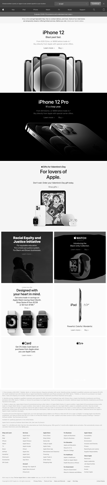

# snapify
create beautiful page screenshots

# install
```bash
yarn add snapify
```

# usage
```js
const snap = require('./snapify');
(async () => {
  await snap('https://apple.com', {
    viewports: ['iPad Pro'],
    fullPage: true,
    style: {
      filter: 'grayscale(100%)'
    }
  });
})();
```



# features
    ✅ plug and play
    ✅ element screenshots
    ✅ custom css styles
    ✅ custom pre-snap script
    ✅ supports all chrome emulated devices and their orientation
    ✅ supports lazy loaded websites by scrolling the page
    ✅ uses puppeteer-cluster for concurrenct screenshots


# api
```typescript
async snap(url: string, options?: SnapifyOptions): Promise<Array<Buffer>>;
```

# options

## `name`?: string;
## `location`?: string;
## `viewports`?: Viewport[]
## `style`?: string;
## `script`?: string;
## `fullPage`?: boolean;
## `scroll`?: boolean;
## `persist`?: boolean;